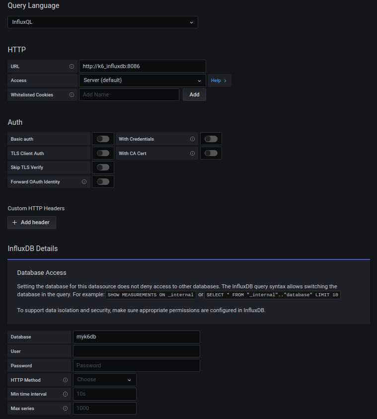

# Testes de carga com K6

## Que diabos K6

[K6](https://k6.io/docs/) uma ferramenta de teste carga gratuita e open-source. Desenvolvido para rodar testes de alta carga (spike, stress e soak) em ambientes de pré-produção e QA.
Também oferece primitivos para monitoramento de testes.

> Nota: Dentre as possibilidades de export dos resultados temos: CloudWatchm Kafka, Datadog, New Relic, além de json e csv e outros.

## Instalando e rodando o teste

Você pode instalar o k6 na sua máquina ou pode rodar utilizando uma imagem docker. Vide [instruções](https://k6.io/docs/getting-started/installation).

> As instruções seguintes consideram que estará utilizando docker para rodar os testes

Os testes com K6 são escritos em JavaScript. Como experimento, crie um arquivo simples:

[Doc da API JavaScript do K6](https://k6.io/docs/javascript-api)

```javascript
// script.js

export default function () {
    console.log("[INFO] Yep, it works!!")
}
```

E tente rodar:

```bash
docker run -i loadimpact/k6 run - <script.js
```

ou

```bash
docker run -v "$(pwd)":/test -i loadimpact/k6 run /test/script.js
```

## Integração com o Grafana

A integração com o Grafana faz uso do InfluxDB, um banco de dados de séries de temporais (por enquanto, não é possível utilizar o Prometheus no lugar do influxdb).

1. Rode o Grafana e o InfluxDB

    ```bash
    docker-compose up -d grafana influxdb
    ```

2. Configure o datasource no Grafana em `Configuration > Data Sources > Add data source` com valores

    

3. Crie ou importe um dashboard para os testes com K6. A própria [doc](https://k6.io/docs/results-visualization/influxdb-+-grafana/#preconfigured-grafana-dashboards) disponibiliza links para alguns dashboards já prontos. Teste com o dashboard [10660](https://grafana.com/grafana/dashboards/10660) ou [2587](https://grafana.com/grafana/dashboards/2587)

4. Rode o script de teste

    ```bash
    docker-compose up k6
    ```

5. (Opcional) Caso deseje ver os dados do influxdb num dashboard, rode o Chronograf

    ```bash
    docker-compose up -d chronograf
    ```

## Calculando a quantidade de Vus

> Nota: Agora temos opções de `scenarios` que deixam a gente controlar a quantidade de rps. O exemplo da próxima sessão apresentará como exemplo.

- [Cálcular RPS](https://k6.io/blog/ref-how-to-generate-a-constant-request-rate-in-k6)
- [RPS constante](https://k6.io/blog/how-to-generate-a-constant-request-rate-with-the-new-scenarios-api)

```text
Request Rate = (VU * R) / T

Onde:
T = (R * http_req_duration) + 1s

- Request Rate: measured by the number of requests per second (RPS)
- VU: the number of virtual users
- R: the number of requests per VU iteration
- T: a value larger than the time needed to complete a VU iteration
```

Passos

1. Já temos `R` que é definido pelo script.

1. Calculamos `T`, que é dado pela quantidade de requisições vezes o tempo esperado para que elas aconteçam mais uma brecha de delay.

1. Decida quantos RPS deseja atingir.

1. E substitua na fórmula acima.

Exemplo:

```text
Considerando que temos um teste que faz 10 requisições 
e que cada leva cerca de 30ms e que queremos atingir
cerca de 1000 rps (60000 rpm).

R = 10
T = 10 * 30ms (0,5s) + 1 = 6s
RPS = 1000

VU = RPS * T / R = 1000 * 6 / 10 = 600
```
